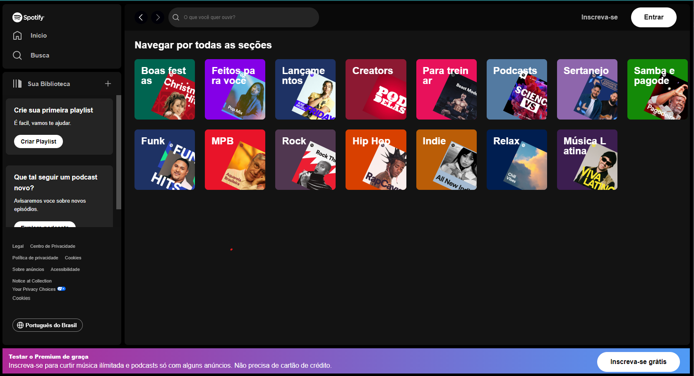
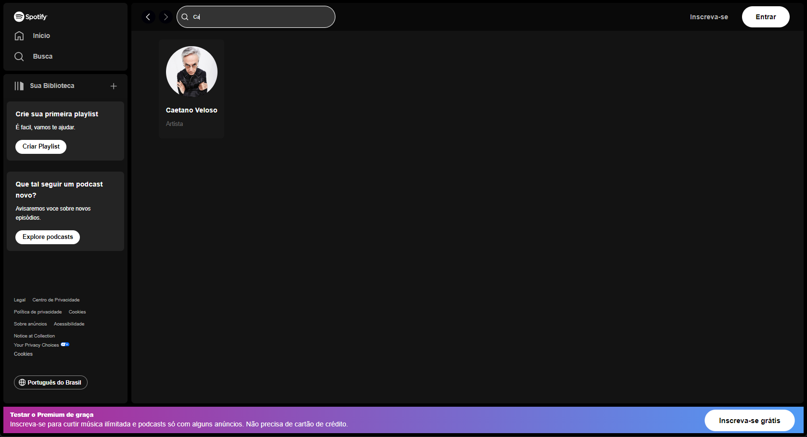

# Spotify Clone (Pt-Br)

Este é um repositório que contém uma versão simplificada e básica de um clone da página inicial do **Spotify**. Este projeto foi desenvolvido com o objetivo de praticar e demonstrar habilidades de desenvolvimento web, utilizando **HTML**, **CSS** e **JavaScript**. O projeto está hospedado no **GitHub Pages** e você pode acessá-lo através do seguinte link: [Spotify Clone](https://danielmadr.github.io/Spotify-ClonePage/)

## Visão Geral

O projeto está estruturado da seguinte forma:

- **index.html**: Contém a estrutura HTML da página.
- **style.css**: Arquivo CSS para estilizar a página.
- **script.js**: Arquivo JavaScript contendo funcionalidades interativas.

O objetivo deste projeto é recriar a aparência e funcionalidade da página inicial do Spotify. Ele inclui:

- **Layout Responsivo**: O design se adapta a diferentes tamanhos de tela.
- **Visual Atraente**: Utilização de estilos CSS para tornar a página agradável visualmente.
  
## Capturas de Tela

*Captura de tela da Página Inicial*

*Captura de tela da Página de Pesquisa*

## Contribuição

Contribuições são bem-vindas! Se você encontrar algum problema ou tiver sugestões de melhorias, sinta-se à vontade para abrir uma **issue** ou enviar um **pull request**.

## Licença

Este projeto está licenciado sob a licença MIT. Consulte o arquivo LICENSE para obter mais detalhes.

---

**Nota**: Este projeto é apenas para fins educacionais e não tem afiliação oficial com o Spotify.

***

# Spotify Clone (En)

This is a repository containing a simplified and basic version of a clone of the **Spotify** homepage. This project was developed with the aim of practicing and demonstrating web development skills using **HTML**, **CSS**, and **JavaScript**. The project is hosted on **GitHub Pages**, and you can access it through the following link: [Spotify Clone](https://danielmadr.github.io/Spotify-ClonePage/)

## Overview

The project is structured as follows:

- **index.html**: Contains the HTML structure of the page.
- **style.css**: CSS file to style the page.
- **script.js**: JavaScript file containing interactive functionalities.

The goal of this project is to recreate the appearance and functionality of the Spotify homepage. It includes:

- **Responsive Layout**: The design adapts to different screen sizes.
- **Appealing Visuals**: Use of CSS styles to make the page visually pleasing.

## Screenshots

*Screenshot of the Home Page*

*Screenshot of the search Page*

## Contribution

Contributions are welcome! If you encounter any issues or have suggestions for improvements, feel free to open an **issue** or submit a **pull request**.

## License

This project is licensed under the MIT License. See the [LICENSE](LICENSE) file for more details.

---

**Note**: This project is for educational purposes only and is not officially affiliated with Spotify.
